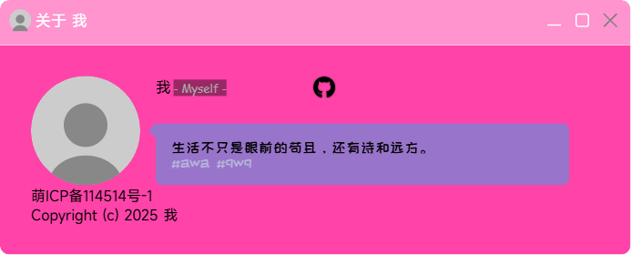

<div align="center">

# aboutYourself
  
一个普通的个人主页主题  
基于 Vite+Vue3+TypeScript 开发  
喜欢请点亮 ⭐ 谢谢喵~

</div>

## 使用方法
### 一键部署
[](https://vercel.com/import/project?template=https://github.com/LateDreamXD/about-yourself)
[](https://app.netlify.com/start/deploy?repository=https://github.com/LateDreamXD/about-yourself)

~~部署到 GitHub Pages 请参阅[教程](https://latedream.ggff.net/posts/Vite-项目部署到-GitHub-Pages-教程/)~~ 还没写 awa

### 修改资料和个性化
按照 JS Doc 注释修改 [`ays.config.ts`](./ays.config.ts) 就行 awa  
如果你觉得注释不够详细 可以查阅[详细个性化指北](docs/CUSTOMIZE.md) awa

### 本地开发
环境要求:
- [%2B-node?style=social&logo=node.js&label=Node.js
)](https://nodejs.org/en/download)
- [](https://yarnpkg.com/getting-started/install)
```bash
git clone https://github.com/LateDreamXD/about-yourself.git
cd about-yourself
yarn
yarn dev
```
